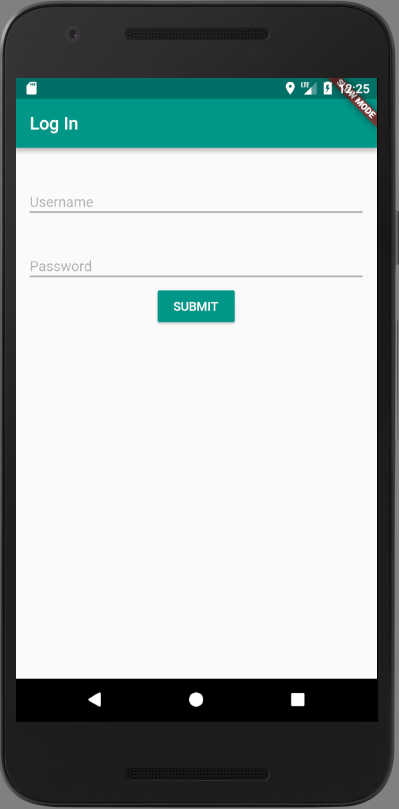
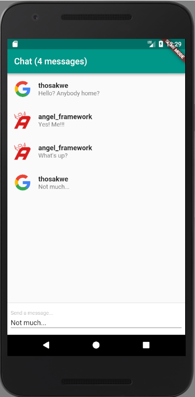

# flutter
[Tutorial on Dart Academy](https://dart.academy/building-a-real-time-chat-app-with-angel-and-flutter/)

A realtime chatroom built with
[Angel](https://angel-dart.github.io) and
[Flutter](https://flutter.io).

This application uses WebSockets and local authentication,
as well as service hooks. In terms of server-side code, it is relatively
simple; this serves as a testament to Angel's promise of expedited
development cycles.

## Organization
This project is divided into three sub-projects:

* `common` - Shared code, i.e. models.
* `server` - A server powered by the Angel framework
* `client` - A mobile app, written with [Flutter](https://flutter.io), that queries the `server`.

## Learn More

To learn more about the Angel framework, check out the 
[main website](https://angel-dart.github.io) and
[wiki](https://github.com/angel-dart/angel/wiki).

Also consider starring the [main repo](https://github.com/angel-dart/angel)! Thank you!
